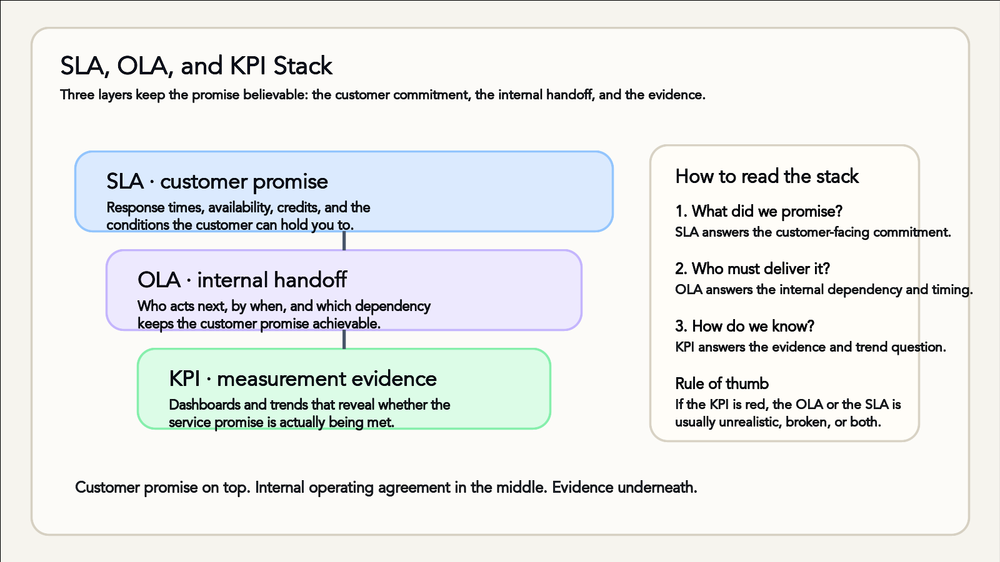

When Kestrel Freight won the contract to handle overnight distribution for a national supermarket chain, the celebration lasted about an hour. Then the contract landed on Priya's desk. Priya is Kestrel's service delivery manager, and Schedule 4 of the contract was a service level agreement: if the customer's booking portal goes down, Kestrel's IT team must respond within fifteen minutes and restore service within four hours, around the clock, every day of the year. Miss the target and the customer receives a service credit — real money off next month's invoice. Miss it repeatedly and the customer can walk away from the whole contract.

Priya's first question wasn't "can we sign this?" It was "can we *deliver* this?" — and that question is what this topic is about. Service level agreements, operational level agreements and key performance indicators are three layers of the same structure: the promise you make, the internal handoffs that make the promise achievable, and the evidence that tells you whether you're keeping it.

## The anatomy of an SLA

A service level agreement is a documented agreement between a service provider and a customer that defines what the service is and what level of performance the customer can expect. The customer might be external, like Kestrel's supermarket client, or internal — most large organisations have SLAs between the IT department and the business units it serves. Either way, a useful SLA answers the same questions:

- **What's covered.** Which services, which environments, which components. "The booking portal" needs pinning down: does that include the mobile app? The reporting module? The test environment? (Almost certainly not the test environment.)
- **When support is available.** Business hours only, extended hours, or 24/7. Support hours are one of the biggest cost drivers in any SLA, because after-hours coverage means paying people to be on call.
- **How fast the team responds and resolves.** These are two different clocks. *Response time* is how quickly a human acknowledges the issue and starts working on it. *Resolution time* is how quickly service is restored. Both are usually tiered by priority.
- **How performance is measured.** Which tool records the timestamps, whether the clock pauses while waiting on the customer, and over what period compliance is calculated — usually monthly.
- **What happens when targets are missed.** Service credits, escalation to senior management, and in serious cases termination rights. Nobody enjoys a penalty clause, but it does something valuable: when three things break at once, the SLA tells everyone which one gets fixed first.

A typical priority structure looks like this:

- **P1 — service down for everyone.** Respond in 15 minutes, restore in 4 hours, 24/7.
- **P2 — service degraded, or down for one site.** Respond in 1 hour, resolve within 1 business day.
- **P3 — single user affected, workaround available.** Respond in 4 business hours, resolve within 5 business days.

Notice how the numbers embody judgement. A P1 target of four hours means the organisation has decided it can survive a four-hour outage but not an eight-hour one — and it's willing to pay for the staffing and redundancy that a four-hour promise requires. An SLA is ultimately an economic document wearing technical clothing.

## OLAs: the promises behind the promise

Here's the trap Priya has to avoid: signing a customer-facing promise that no single team inside Kestrel can actually keep. Restoring the booking portal in four hours isn't one team's job. The service desk has to triage the incident, the application team has to diagnose it, and if the database is the culprit, Dana's database team has to fail over to the standby server. If any link in that chain is slow, the SLA is breached — even though every individual team might feel it did its bit promptly.

Operational level agreements exist to close that gap. An OLA is an internal commitment between teams inside the same organisation, written to support a customer-facing SLA. Dana's team, for example, commits to a five-minute database failover, any time of day. The application team commits to acknowledging a portal escalation within ten minutes. The network team commits to a two-hour turnaround on firewall changes flagged as incident-related. None of these are legal contracts — no one is suing the database team — but they are written down, agreed and measured, which changes behaviour in exactly the way a verbal "yeah, we'll be quick" does not.

The discipline here is traceability. Every clause in the SLA should decompose into OLAs (and, where external suppliers are involved, into *underpinning contracts* with those vendors) that add up to the promised outcome. If the SLA says four hours and the OLAs underneath it sum to six, you haven't made a promise — you've scheduled a breach. When Priya reviewed Schedule 4, she went team by team asking, "what would you have to commit to for this to work?" Two OLAs had to be renegotiated and one on-call roster expanded before she let anyone sign.

## KPIs: how you know

Agreements without measurement are decoration. Key performance indicators turn the SLA and OLA structure into numbers you can track, report and argue about productively. The common ones for support services:

- **Response and resolution times** against target, per priority level.
- **SLA compliance rate** — the percentage of incidents resolved within target, usually reported monthly.
- **First-call resolution** — the share of issues fixed at first contact, without escalation. A good proxy for both service desk skill and knowledge-base quality.
- **Availability (uptime)** — the percentage of time the service was usable, measured by monitoring tools rather than by whether anyone complained.

The value is in the trend, not the snapshot. One bad month is noise; three consecutive months of slipping P2 resolution times is a signal. When a target keeps being missed, there are only two honest responses: fix the workflow that's failing, or renegotiate the target because it was never realistic. Quietly missing it every month while nobody mentions it — the most common third option in the wild — corrodes trust in the whole system. The stack diagram above gives you the rule of thumb: when a KPI goes red, the OLA or the SLA above it is usually unrealistic, broken, or both.

KPIs also feed continual improvement, which gets its own topic later in this part. Priya's monthly report doesn't just say "97.2% SLA compliance"; it says which categories of incident caused the misses, which feeds directly into decisions about training, staffing and automation. And targets aren't carved in stone: when Kestrel's supermarket client moved to overnight restocking, "business hours" support for the warehouse systems stopped matching reality, and the SLA was renegotiated to match how the business actually operated.

> A warning about what practitioners call *watermelon metrics*: green on the outside, red on the inside. A service can hit 100% of its SLA targets while users are miserable — because the targets measure the wrong things, or because staff learn to game the clock (responding instantly with a meaningless "we're looking into it," then letting the real work languish). If your compliance report is green and your customers are grumpy, believe the customers, then go fix your metrics.

## Where you fit in

If you join a support team, SLAs will shape your daily work from week one: the queue you work from is sorted by SLA clock, and the "time to breach" counter next to each ticket is what makes a P1 feel different from a P3. As you get more senior, the work shifts from meeting the numbers to *setting* them — service delivery managers like Priya spend much of their time negotiating SLAs, brokering OLAs between teams that don't report to each other, and defending or revising targets with data. It's a genuine career path, and it rewards a rare combination: enough technical depth to know what's achievable, and enough commercial sense to know what a promise costs.

The takeaway is a habit of mind. Whenever you see a service promise, ask the three questions the stack implies: what exactly did we promise, which teams have agreed to the handoffs that make it possible, and what evidence would tell us — before the customer does — that we're failing?
