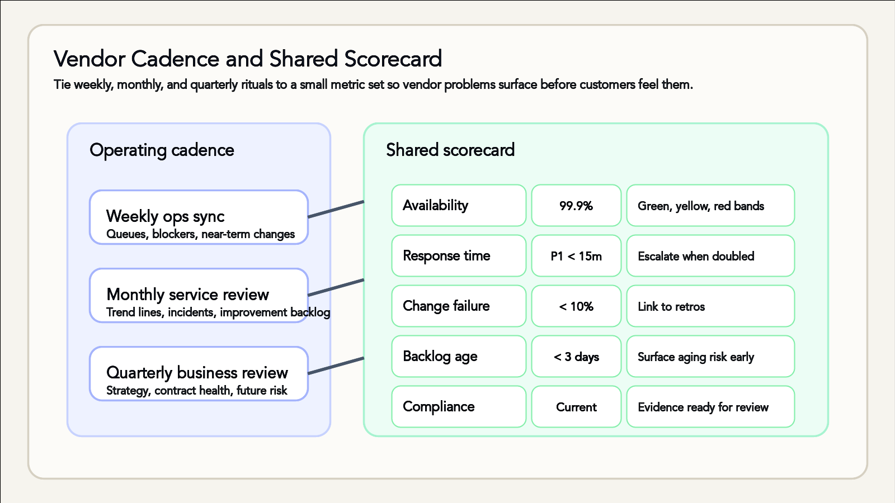

Every startup eventually meets the vendor for whom "urgent" means "next week". At Sarah's startup the lesson arrived at 3am: a marketing campaign went live, traffic rose tenfold, and the MSP monitoring the infrastructure found out about the launch from the outage. The panicked call opened with the immortal words, "We didn't know you were deploying today." Nobody had lied to anyone. There was simply no ritual in which the information could have changed hands. Vendors extend your team, but they follow different incentives and different clocks — and the fix isn't outrage, it's rhythm.

## Cadence as a control system

High-growth teams lean on vendors to fill capability gaps long before they can hire specialists, and that leverage only works when everyone is working to the same beat. Predictable rituals surface risks early, before they hit customers, and they tighten shared expectations about responsiveness, decision velocity and quality gates. Treat cadence as a strategic control system, not a series of polite catch-ups.

Rhythm also lowers the emotional temperature. When a partner knows there is a weekly forum to raise blockers, they don't resort to midnight escalation emails; when leadership sees trend data every month, they can intervene early instead of issuing broad-brush ultimatums. Process gives both sides the psychological safety to be candid about risk — which is the entire point.

## The three-tier drumbeat

The working pattern is three meetings at three altitudes. The **weekly ops sync** is thirty minutes and deliberately tactical: ticket queues, blockers, SLA wobbles and near-term deliverables. The **monthly service review** is an hour, a level higher: the KPI scorecard, incident retrospectives, and the improvement backlog. The **quarterly business review** is ninety minutes and strategic: alignment with company direction, contract health and roadmap shifts.

Anchor each ritual to a beat that already matters. Hold the weekly call before your release deploys, schedule the monthly review after financial close so real cost data is on the table, and run the quarterly session ahead of contract renewal windows. When rituals connect to existing rhythms, the right stakeholders arrive prepared instead of treating the meeting as optional. And no meeting closes without follow-up artefacts — owners, deadlines and notes in the shared workspace — or the momentum evaporates between calls.

## A scorecard both sides believe

Scorecards convert gut feel into shared evidence. Blend the contractual measures — SLAs, which commit to performance, and SLRs, which commit to reporting on it — with adoption and satisfaction signals like internal-stakeholder NPS or product usage analytics. Then add leading indicators: backlog age, staffing ratios and change failure rate wobble well before a contractual breach does, which is when you actually want to know.

Data hygiene decides whether anyone trusts the thing. Pull metrics from a single source of truth, freeze a snapshot before each review, and annotate anomalies rather than quietly smoothing them. Traffic-light thresholds must be predefined so a red cell automatically triggers escalation and executive visibility, rather than a debate about whether it's really red. A workable starting template:

- **Availability (SLA):** green at 99.9% or better, yellow 99.5–99.89%, red below 99.5%
- **First-response time (SLR):** green under 15 minutes for P1 and under an hour for P2; yellow at double the target; red beyond four times it
- **Change failure rate:** green under 10%, yellow 10–20%, red above 20%
- **Backlog age for critical tickets:** green under three days, yellow three to five, red beyond five
- **Stakeholder NPS:** green at 50 or above, yellow 20–49, red below 20
- **Compliance status:** green when audits are current, yellow when evidence is pending, red when a gap is identified

Six crisp metrics with thresholds beat thirty vague ones. Example bands for a latency metric work the same way: API responses under 200ms green, 200–500ms yellow, beyond that red.

## Running the rituals well

The weekly sync should feel like a high-signal standup, not a status monologue. Cap it at thirty minutes with a three-slide deck: performance snapshot, escalations, upcoming changes. Every yellow or red metric gets an owner and a due date before the call ends — anything without a name resurfaces later as an incident. Capture blockers that need internal help too: access, decisions, budget. Then close with a "no surprises" scan — launches, audits, marketing campaigns, staffing changes, peak demand. The concrete prompt is worth memorising: "We're launching the Black Friday campaign next week and expect ten times the traffic — can your monitoring handle the alert volume?" That habit gives vendors permission to flag constraints before they become outages, and it is precisely what retires the 3am phone call from the opening scene.

The monthly review interrogates trend lines, not last month's value. Verify that incident action items actually closed, revisit capacity forecasts and staffing assumptions for the next sixty days, and agree on two or three experiments or optimisations before the next review. Celebrate wins and recognise the vendor team's contributions while you're at it — relationship health is a metric too; it just doesn't fit on the scorecard.

## Trust, but rehearse

Vendor security assessment is a recurring ritual, not a one-off procurement hurdle. Require up-to-date SOC 2 or ISO 27001 evidence and map the controls to your actual data flows rather than filing the PDF unread. Run joint data-handling tabletop drills — breach notification timing, encryption practices, off-boarding — and align vendor access reviews with your internal identity-governance cadence, so a leaver on their side loses access on your schedule, not theirs.

Crisis readiness gets the same treatment. Pre-build the shared incident channel, the escalation ladder and the on-call rotation map before you need them. Run joint simulations for a vendor outage, a data breach and a sudden demand spike, and settle decision authority in advance: who calls the rollback, who owns customer communications, who notifies regulators. Capture the learnings in a post-mortem template shared across both companies, because an incident you rehearsed together is one you'll survive together.

## Contracts and chemistry

At negotiation time, remember the SLA/SLR distinction and negotiate both — a vendor that performs but can't prove it is, for governance purposes, indistinguishable from one that doesn't. Tie penalty clauses to business impact: downtime credits, remediation timelines, escalation paths. Specify the exit before you sign — data export formats, transition assistance, knowledge-transfer windows — and capture renewal notice periods and price-uplift caps inside the master services agreement. Your moment of maximum leverage is before the signature, never after.

Cultural fit is a due-diligence item, not a vibe. Observe the vendor team's actual rituals — standups, retros, documentation habits — and ask whether they match your pace. Meet the delivery leads who will do the day-to-day work, not just the sales crew. Align communication norms — channels, response times, decision logs — before signing, and use a pilot project or trial sprint to test the collaboration chemistry while the stakes are still small.

## Make versus buy is a living decision

Reassess quarterly: does outsourcing still unlock speed, or has it become drag? Model the total cost honestly — subscription, integration effort, the shadow team that manages the vendor, compliance overhead — and weigh strategic control: IP sensitivity, customer intimacy, regulatory obligations. Document the thresholds that trigger an RFP or an insourcing exploration, so the decision is a process rather than a mood.

Two cases anchor the trade-off. **Stripe versus building payments:** Stripe's SDKs get you live in weeks where an in-house build means new headcount; the fees look high until you price hiring, PCI compliance scope and 24/7 monitoring; outsourcing costs you roadmap control, so negotiate premium support for reliability; and Stripe's redundancy is proven, a bar your custom stack must reach before it counts as an alternative. **Zendesk versus building support ops:** templates, macros and AI triage launch a support desk in days; the subscription competes against hiring, training and running a 24/7 desk; the platform's roadmap dictates feature availability where an internal team could build bespoke workflows; and the risk trade is a vendor outage on one side versus team burnout without mature processes on the other. The pattern generalises — buy where the vendor's scale solves problems you shouldn't own, and revisit the moment the business changes shape.

## Write it down

Centralise agendas, scorecards and action logs in one shared workspace, with versioned notes and decisions so institutional memory survives turnover on either side. Automate reminders through your ticketing system or CRM so overdue actions chase themselves, and store vendor runbooks alongside incident response and onboarding guides. Future you will thank present you for taking notes; future you is notably less patient with mystery decisions.

For founders, the whole topic compresses into four moves: ritualise the touchpoints so vendors feel like part of the operating rhythm; keep the scorecard visible, so green gets celebrated and red gets swift support rather than quiet resentment; treat make-versus-buy as a living decision, not a slide from the seed deck; and document relentlessly, because your successor will need the receipts.
